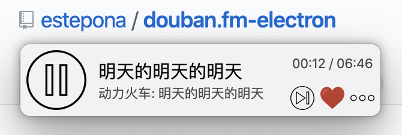

  <h1>douban.fm Desktop</h1>
  
A tiny, elegant <a src="https://douban.fm/">douban.fm</a> desktop client built with electron.js

  
  
  

  </img>

[中文](./README.md) | **EN**

## Features

- login/logout, cookie saving
- channels:
    - douban selected
    - douban recommended
    - liked songs
    - personal channel
- set window on top
- ...

## Install

Mac and Windows installers can be found at [Release Page](https://github.com/estepona/douban.fm-electron/releases).

## Shortcuts

- pause or play: <kbd>space</kbd>
- next song: <kbd>right</kbd>
- like song: <kbd>up</kbd>
- unlike song: <kbd>down</kbd>
- refresh: <kbd>Ctrl</kbd> + <kbd>R</kbd> (Win / Linux), <kbd>Cmd</kbd> + <kbd>R</kbd> (Mac)
- set window on top: <kbd>Ctrl</kbd> + <kbd>E</kbd> (Win / Linux), <kbd>Cmd</kbd> + <kbd>E</kbd> (Mac)
- relaunch: <kbd>Ctrl</kbd> + <kbd>L</kbd> (Win / Linux), <kbd>Cmd</kbd> + <kbd>L</kbd> (Mac)
- quit: <kbd>Ctrl</kbd> + <kbd>Q</kbd> (Win / Linux), <kbd>Cmd</kbd> + <kbd>Q</kbd> (Mac)

## Known Issues

- Currently, only username/password login is supported, phone/code or 3rd-party login are not supported;
- To view "从单曲出发", please login and relaunch;

## Troubleshooting

Refreshing solves most problems!

## References

- [豆瓣FM API](https://github.com/zonyitoo/doubanfm-qt/wiki/%E8%B1%86%E7%93%A3FM-API)
- [豆瓣电台api](https://blog.csdn.net/hello2me/article/details/42078317)
- [各种音乐平台API整理 | Music APIs](https://www.fangr.cc/2018/01/22/music-apis-md.html#%E8%B1%86%E7%93%A3FM)

## Author

[Binghuan Zhang](https://github.com/estepona) - esteponawondering@gmail.com

## Contributors

- [Zizhao Wang](https://github.com/MikuZZZ)
- [Xiaoyan Wang](https://github.com/miniwangdali)

## Credit

Icons made by <a href="https://www.flaticon.com/authors/smashicons" title="Smashicons">Smashicons</a> from <a href="https://www.flaticon.com/" title="Flaticon">www.flaticon.com</a> is licensed by <a href="http://creativecommons.org/licenses/by/3.0/" title="Creative Commons BY 3.0" target="_blank">CC 3.0 BY</a>

## LICENSE
MIT
