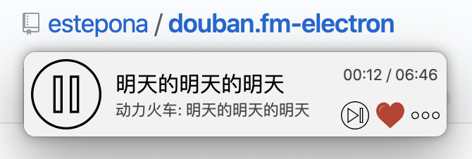

# douban.fm-electron
A tiny, elegant [douban.fm](https://douban.fm/) desktop client developed with electron.

  </img>

If anything doesn't work, try refreshing!

## Features
- login/logout, cookie saving
- channels:
    - douban selected / 豆瓣精选
    - douban recommended / 豆瓣推荐
    - liked songs / 红心歌曲
    - personal channel / 私人频道
- set window on top / 置顶
- ...

## Install

Mac and Windows installers can be found at https://github.com/estepona/douban.fm-electron/releases.

Currently all releases are pre-releases, if you find any bugs and have any feature improvements, please submit an issue! Thank you!

## Shortcuts
- pause or play: `space`
- next song: `right`
- like song: `up`
- unlike song: `down`
- refresh: `F5` (Win / Linux), `Cmd+R` (Mac)
- set window on top: `Alt+F2` (Win / Linux), `Cmd+E` (Mac)
- relaunch: `Alt+F3` (Win / Linux), `Cmd+L` (Mac)
- quit: `Alt+F4` (Win / Linux), `Cmd+Q` (Mac)

## Known Issues
- To view "从单曲出发", please login and relaunch;

## References
- [豆瓣FM API](https://github.com/zonyitoo/doubanfm-qt/wiki/%E8%B1%86%E7%93%A3FM-API)
- [豆瓣电台api](https://blog.csdn.net/hello2me/article/details/42078317)
- [各种音乐平台API整理 | Music APIs](https://www.fangr.cc/2018/01/22/music-apis-md.html#%E8%B1%86%E7%93%A3FM)

## Author
[Binghuan Zhang](https://github.com/estepona)

## Contributors
- [Zizhao Wang](https://github.com/MikuZZZ)
- [Xiaoyan Wang](https://github.com/miniwangdali)

## Credit

Icons made by <a href="https://www.flaticon.com/authors/smashicons" title="Smashicons">Smashicons</a> from <a href="https://www.flaticon.com/" title="Flaticon">www.flaticon.com</a> is licensed by <a href="http://creativecommons.org/licenses/by/3.0/" title="Creative Commons BY 3.0" target="_blank">CC 3.0 BY</a>

## LICENSE
MIT